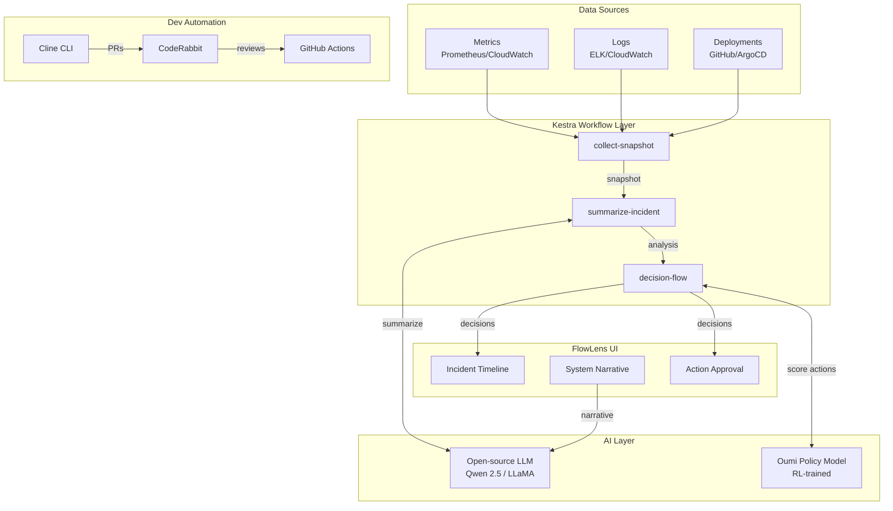

#                                    🔍 FlowLens


<p align="center">
  
  
  
  
</p>


> **AI Ops Copilot** — Autonomous analysis and action for data-driven teams

FlowLens is an AI agent that watches your data workflows, summarizes what's happening, and takes safe autonomous actions. It acts as an intelligent control plane that monitors systems, detects incidents, and proposes or executes remediation actions with human approval.

## ✨ Features

- **🔄 Autonomous Monitoring** — Kestra workflows continuously collect metrics, logs, and deployment data
- **🧠 AI-Powered Analysis** — Open-source LLMs (Qwen/LLaMA/Mistral) provide root cause analysis and recommendations
- **⚡ Smart Decision-Making** — Oumi-trained policy model scores actions and auto-approves safe ones
- **🎯 Human-in-the-Loop** — Risky actions require approval through the real-time dashboard
- **📊 Live Narrative** — Natural language "story" of system health over the last 24 hours
- **🤖 Dev Automation** — Cline CLI automates code changes with CodeRabbit PR reviews

## 🏗️ Architecture



## 🚀 Quick Start

### Prerequisites

- Node.js 18+
- Docker & Docker Compose (for Kestra)
- npm or yarn

### 1. Clone & Install

```bash
git clone https://github.com/your-username/flowlens.git
cd flowlens

# Install UI dependencies
cd packages/ui
npm install
```

### 2. Run the Dashboard

```bash
npm run dev
```

Open [http://localhost:3000](http://localhost:3000) to see the FlowLens dashboard.

### 3. (Optional) Start Kestra

```bash
# From project root
docker-compose up -d

# Access Kestra UI
open http://localhost:8080
```

### 4. Demo the System

1. Click **"Simulate Incident"** button in the dashboard
2. Watch the incident appear in the timeline
3. Click on the incident to see AI analysis
4. Approve or deny proposed actions

## 📁 Project Structure

```
flowlens/
├── packages/
│   ├── ui/                    # Next.js dashboard (Vercel)
│   │   ├── src/
│   │   │   ├── app/           # App router pages
│   │   │   ├── components/    # React components
│   │   │   └── lib/           # Types, API client & hooks
│   │   └── package.json
│   ├── backend/               # Python FastAPI server
│   │   ├── main.py            # API endpoints
│   │   ├── models.py          # Pydantic models
│   │   ├── services/          # Kestra & LLM integrations
│   │   └── requirements.txt
│   ├── kestra-flows/          # Kestra workflow definitions
│   │   └── flows/
│   │       ├── collect-snapshot.yaml
│   │       ├── summarize-incident.yaml
│   │       └── decision-flow.yaml
│   ├── oumi-training/         # Oumi RL training configs
│   │   ├── configs/
│   │   └── data/
│   └── cline-tools/           # Cline automation tasks
│       └── tasks/
├── docker-compose.yaml        # Kestra + dependencies
├── .github/workflows/         # CI/CD
└── README.md
```

## 🔧 Tool Integration

### Kestra AI Agent

Kestra orchestrates the entire data pipeline:

1. **collect-snapshot** — Aggregates metrics, logs, and deployment events
2. **summarize-incident** — Uses LLM to analyze data and propose actions
3. **decision-flow** — Applies policy model, executes safe actions, sends approvals to UI

[📖 Kestra Flows Documentation](./packages/kestra-flows/README.md)

### Oumi RL Training

Oumi fine-tunes the decision policy:

- **SFT** — Supervised learning on labeled good/bad decisions
- **DPO/RL** — Preference learning from human approvals/denials
- **LLM-as-Judge** — Automatic quality scoring

[📖 Oumi Training Documentation](./packages/oumi-training/README.md)

### Cline CLI

Dev automation for maintaining FlowLens:

```bash
# Add a new metric to the pipeline
cline task add-metric --metric_name cpu_throttle --unit percent

# Sync Kestra flows with TypeScript types
cline task sync-flows
```

[📖 Cline Tools Documentation](./packages/cline-tools/README.md)

### CodeRabbit

Every PR is automatically reviewed by CodeRabbit:
- Code quality analysis
- Security checks
- Suggested improvements

## 🎥 Demo Flow (2 minutes)

1. **0:00-0:20** — Overview of the dashboard and system health
2. **0:20-0:40** — Trigger simulated incident (signup drop)
3. **0:40-1:00** — Watch Kestra summarize and propose rollback
4. **1:00-1:20** — Review LLM analysis and approve action
5. **1:20-1:40** — Show Cline opening a PR with fix
6. **1:40-2:00** — Brief Oumi training metrics visualization

## 🌐 Deployment

### Vercel (Recommended)

1. Push to GitHub
2. Connect repo to Vercel
3. Set project root to `packages/ui`
4. Deploy!

[](https://vercel.com/new/clone?repository-url=https://github.com/your-username/flowlens)

### Self-Hosted

```bash
# Build the UI
cd packages/ui
npm run build

# Start production server
npm start

# Or with Docker
docker-compose --profile full up
```

## 🤝 Contributing

1. Fork the repository
2. Create a feature branch
3. Make changes (Cline can help!)
4. Open a PR (CodeRabbit will review)
5. Get approval and merge

## 📄 License

MIT License — see [LICENSE](./LICENSE) for details.

---

<p align="center">
  Built for <strong>Assemble Hack 2025</strong> with ❤️
  <br/>
  Powered by Kestra • Oumi • Cline • Open-source LLMs • Vercel
</p>
