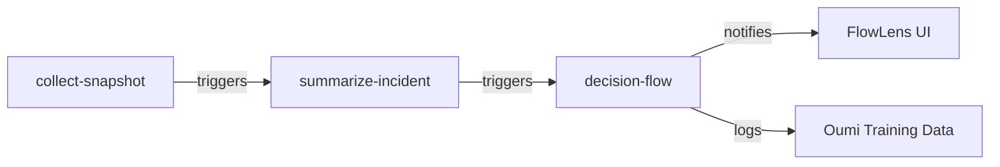

# Kestra Flows for FlowLens

This directory contains Kestra workflow definitions for the FlowLens AI Ops Copilot.

## Flows Overview



### 1. `collect-snapshot.yaml`

**Purpose**: Collects metrics, logs, and deployment data from various sources.

**Inputs**:
- `time_range`: Time range to collect (default: 15m)
- `services`: List of services to monitor

**Outputs**:
- `snapshot`: Structured JSON with all collected data
- `snapshot_id`: Unique identifier for the snapshot

**Trigger**: Scheduled every 5 minutes (disabled by default)

### 2. `summarize-incident.yaml`

**Purpose**: Uses LLM to analyze snapshots and generate incident summaries.

**Features**:
- Anomaly detection for metrics
- LLM-powered root cause analysis
- Action recommendations

**Model**: Qwen 2.5 (7B) via Ollama

**Outputs**:
- `analysis_result`: Full analysis with summary, root cause, and actions
- `anomaly_count`: Number of detected anomalies

### 3. `decision-flow.yaml`

**Purpose**: Autonomous decision layer that evaluates and executes actions.

**Features**:
- Policy model scoring (Oumi-trained)
- Auto-approval for low-risk actions
- Human approval workflow for risky actions
- Training data logging for RL

**Outputs**:
- `decision`: Evaluated actions with confidence scores
- `auto_executed_count`: Number of auto-approved actions
- `pending_approval_count`: Actions awaiting human approval

## Local Development

### Prerequisites

- Docker & Docker Compose
- Kestra server (see root `docker-compose.yaml`)

### Import Flows

```bash
# Start Kestra
docker-compose up -d kestra

# Access Kestra UI
open http://localhost:8080

# Flows are auto-imported from ./flows directory
```

### Testing Flows

```bash
# Trigger collect-snapshot manually
curl -X POST http://localhost:8080/api/v1/executions/flowlens.ops/collect-snapshot

# View execution
curl http://localhost:8080/api/v1/executions/{execution_id}
```

## Integration with UI

The `decision-flow` sends pending approvals to the FlowLens UI via webhook:

```
POST /api/decisions
{
  "decision_id": "...",
  "evaluated_actions": [...],
  "pending_count": 2
}
```

## Customization

### Adding New Data Sources

1. Add a new task in `collect-snapshot.yaml`
2. Update the `create_snapshot` task to include new data
3. Update `summarize-incident.yaml` prompt if needed

### Adjusting Policy Thresholds

In `decision-flow.yaml`, modify:
- `auto_approve_low_risk`: Enable/disable auto-approval
- Confidence thresholds in `evaluate_actions` task
