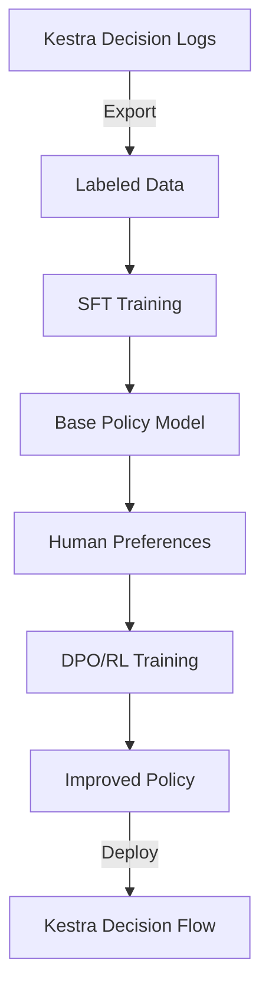

# Oumi Training for FlowLens Policy Model

This package contains configurations and data for training the FlowLens decision policy model using [Oumi](https://github.com/oumi-ai/oumi).

## Overview

The policy model learns to:
1. **Score proposed actions** with confidence levels
2. **Auto-approve safe actions** while flagging risky ones
3. **Reduce false positives** (noisy alerts, unnecessary actions)
4. **Improve over time** through RL from human feedback

## Training Pipeline



## Files

### Configs

- `configs/policy_sft.yaml` - Supervised fine-tuning config
- `configs/policy_rl.yaml` - Reinforcement learning config (DPO)

### Data

- `data/labeled_decisions.jsonl` - Training data with good/bad labels
- `data/eval_decisions.jsonl` - Evaluation dataset (create from labeled data)
- `data/preference_data.jsonl` - Preference pairs for RL (generate during training)

## Quick Start

### 1. Install Oumi

```bash
pip install oumi
```

### 2. Prepare Training Data

```bash
# Split labeled data into train/eval
python scripts/prepare_data.py

# Generate preference pairs from labels
python scripts/generate_preferences.py
```

### 3. Run SFT Training

```bash
oumi train --config configs/policy_sft.yaml
```

### 4. Evaluate Base Model

```bash
oumi evaluate \
  --model checkpoints/policy-v1/final \
  --data data/eval_decisions.jsonl \
  --metrics accuracy,f1
```

### 5. Run RL Fine-Tuning

```bash
oumi train --config configs/policy_rl.yaml
```

### 6. Deploy to Kestra

```bash
# Export model for inference
oumi export \
  --model checkpoints/policy-rl-v1/final \
  --format gguf \
  --output models/policy-v1.gguf

# Update Kestra flow to use new model
# Edit decision-flow.yaml: policy_model: "policy-v1"
```

## Data Format

### Labeled Decisions (SFT)

```json
{
  "input": {
    "snapshot_id": "snap-001",
    "anomalies": [...],
    "analysis": {...}
  },
  "output": {
    "actions": [
      {
        "id": "0",
        "type": "rollback",
        "confidence": 0.82,
        "auto_approved": false,
        "reasoning": "..."
      }
    ]
  },
  "label": "good"  // or "bad"
}
```

### Preference Pairs (RL)

```json
{
  "prompt": "Evaluate actions for: ...",
  "chosen": "Rollback with 0.82 confidence, require approval...",
  "rejected": "Rollback with 0.95 confidence, auto-approve..."
}
```

## Metrics

The policy model is evaluated on:

| Metric | Description | Target |
|--------|-------------|--------|
| Accuracy | Correct approval decisions | > 90% |
| False Positive Rate | Unnecessary actions taken | < 5% |
| False Negative Rate | Missed critical actions | < 2% |
| Human Override Rate | Decisions humans changed | < 10% |

## Integration with Kestra

The trained model is called from `decision-flow.yaml`:

```yaml
- id: evaluate_actions
  type: io.kestra.plugin.scripts.python.Script
  script: |
    # Load Oumi policy model
    from oumi import load_model
    
    model = load_model("models/policy-v1.gguf")
    actions = model.evaluate(snapshot, analysis)
```

## LLM-as-Judge

We use Oumi's LLM-as-judge feature to:
1. Score candidate summaries quality
2. Compare decision alternatives
3. Generate synthetic preference data

Configure in `policy_rl.yaml`:

```yaml
llm_judge:
  enabled: true
  model: "claude-3-sonnet"
  criteria:
    - action_appropriateness
    - risk_assessment_accuracy
```
